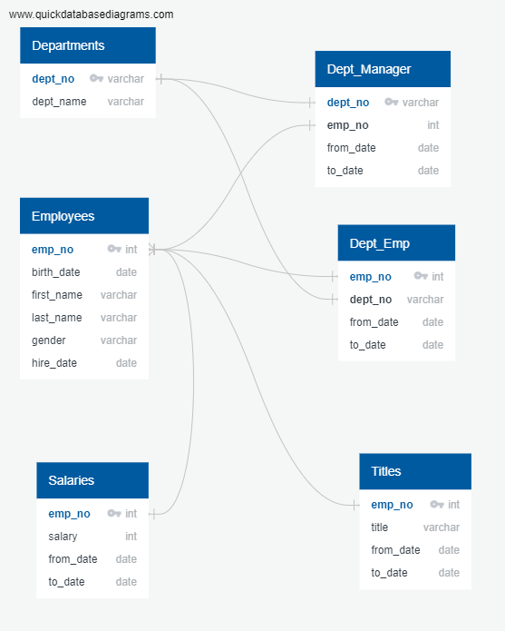

# Pewlett-Hackard-Analysis

### Challenge Overview:
"Management" has requested information regarding the total number of employees per title who will be retiring, and identification employees who are eligible to participate in a mentorship program.

##### Resources:
  -pgAdmin 4
  -QuickDBD

### Challenge Summary:
Analysis of the information show:
  - A total of 33,118 employees will be eligible for retirement soon, consisting of:
    - 13,651 Senior Engineers
    - 12,872 Senior Staff
    - 2,711 Engineers
    - 2,022 Staff
    - 1,609 Technique Leaders
    - 251 Assistant Engineers
    - 2 Managers
 (The retire_titles.csv in Challenge Data shows both a list of the titles retiring and the number of employees with those titles)
 
 - A list of potential employees who are eligible to participate in the mentorship program was provided in the mentorship.csv. The list also includes a history of previous titles held by each employee.
 
 From this data we have access to information regarding salaries. With this information it may be possible to further study areas where we can expect to decrease or increase spending on salary based on company needs and objectives.
 
 ERD of Databases Given:
 
 
 
 
 ### Challenge Process: 
 
  "Management" is expecting a "silver tsunami" in which a large amount of employees will be eligible for retirement. Thus, "Management" has decided that it must preemptively act and prepare for a mass exodus. In order to properly prepare "Management" needed information regarding the types of employees living and an estimation of the amount of employees leaving. Thus it turned to data analytics to describe the situation.
  
  "Management was able to provide some information in the form of various csv files in which personnel information such as birthdate, salary, employee title, name, and experience. My first task was to find connections between all the different files in order to merge the separate information into a usable format. I initially did this by making connections between information types that the csv files shared, and merged the csv files together based on these connection points. An example would be merging employee titles and personal information via their employee number. Thus the primary challenge was connecting the points between these separate datasets. 

   My analysis is summarized in the Challenge Summary above. We can see that a total of 33,118 employees will be eligible for retirement soon. A list was also provided for employees that are available for a mentorship to train the incoming new employees. The limitations of this information is that it only provides the poeple who are eligible for reitrement and not the people that will be retiring. I would think that information would be need to come from employees themselves. The next step for the company would be to start looking at which departments need to start hiring to fulfill their personnel needs. This is also a good opportunity for "Management" to make adjustments to the amount of personnel needed based on changing goals of the company.
